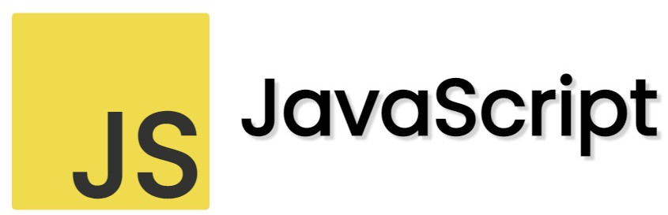

# Intro Javascript
[*ver em pdf*](https://mmamorim.github.io/webdev-24-2/intro-js.pdf)



[Texto baseado na documentação do Mozilla](https://developer.mozilla.org/pt-BR/docs/Learn/JavaScript)

JavaScript® (às vezes abreviado para JS) é uma linguagem leve, interpretada e baseada em objetos com funções de primeira classe, mais conhecida como a linguagem de script para páginas Web, mas usada também em vários outros ambientes sem browser, como o node.js. O JavaScript é uma linguagem baseada em protótipos, multi-paradigma e dinâmica, suportando estilos de orientação a objetos, imperativos e declarativos (como por exemplo a programação funcional). 

O padrão JavaScript é ECMAScript. Desde 2012, todos os navegadores modernos possuem suporte total ao ECMAScript 5.1. Navegadores mais antigos suportam pelo menos ECMAScript 3. Em 17 de Junho de 2015, a ECMA International publicou a sexta versão do ECMAScript, que é oficialmente chamado de ECMAScript 2015, e foi inicialmente conhecido como ECMAScript 6 ou ES6. Desde então, as especificações do ECMAScript são lançadas anualmente. A última versão de referência, é atualmente a ECMAScript 2018.

# Variáveis

**Variáveis** são contêineres que armazenam valores. Você começa declarando uma variável com a palavra-chave ```let```, seguida do nome que você dá à variável:

~~~js
let myVariable;
~~~

## Regras para identificadores

* Sempre começar com letras [a..zA..Z]
* Apenas usar letras [a..zA..Z], números [0..9], underscore _
* Não usar ```palavras reservadas```
* JavaScript diferencia maiúsculas de minúsculas

## Tipos de dados

| Tipo   |      Explicação      |
|----------|:-------------:|
| String |  Sequência de caracteres conhecida como string. Dese estar entre aspas simples, aspas duplas ou tick. |
| Number |    Representa Números (inteiros ou reais)   |
| Boolean | Representa um valor Verdadeiro/Falso. As palavras ```true``` e ```false``` são palavras reservadas |
| Array | Esta é uma estrutura que representa um vetor |
| Object | Representa um Objeto |
		
